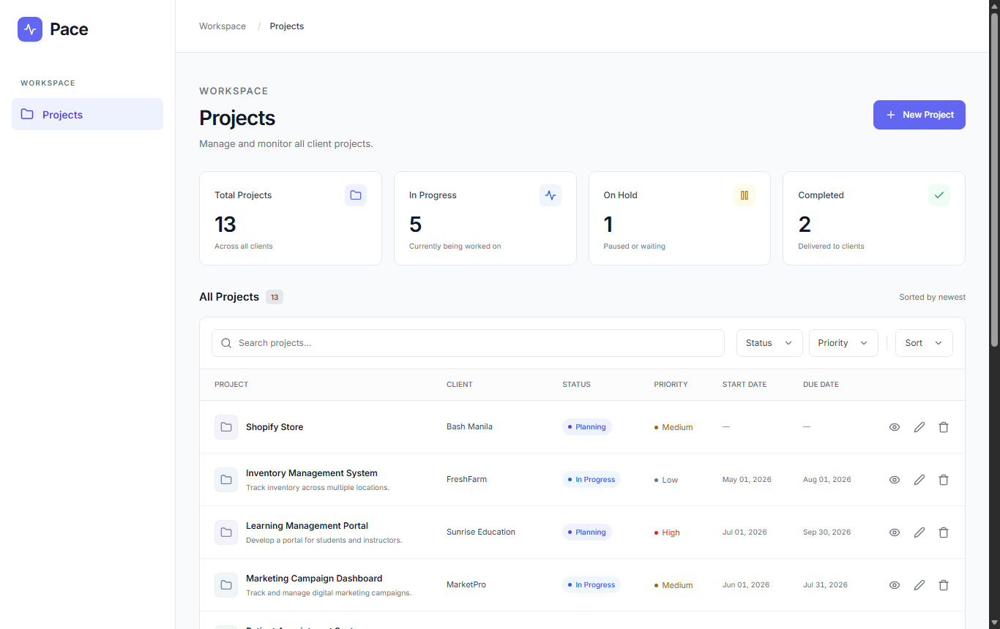
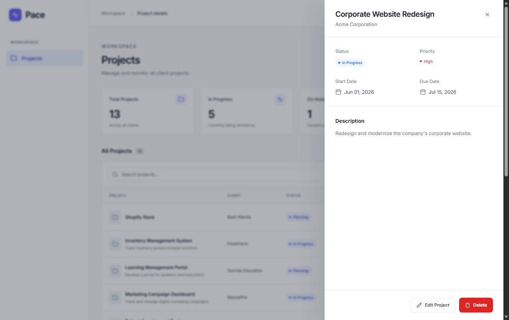

# Pace

Pace is a client project tracker for a digital agency. Project managers use it to see every client project in one place, check its status and priority, and create, edit and delete projects.





## Tech stack

| Layer | Technology |
| --- | --- |
| Backend | Laravel 13 (PHP 8.3) |
| Frontend | Vue 3 and Vue Router, built by Vite |
| Styling | Tailwind CSS v4 with component classes exported from the Figma design |
| Database | MySQL 8 |
| Tests | PHPUnit |

Pace is a single Laravel application: Laravel serves the REST API under `/api` and serves the Vue app for every other URL. See [docs/ARCHITECTURE.md](docs/ARCHITECTURE.md) for how it fits together and [docs/ROADMAP.md](docs/ROADMAP.md) for the build plan.

## Features

- List all projects with summary counts by status
- View a project in a side panel without leaving the list
- Create, edit and delete projects, with a confirmation step before deleting
- Validation in the form and on the server, with messages shown next to each field
- Search by client name, project name or description
- Filter by status and by priority
- Sort by newest, due date, start date, project name or priority
- Pagination, 10 projects per page
- Loading, empty and error states on every screen
- Responsive layout for desktop, tablet and mobile

## Requirements

- PHP 8.3 or newer, with the `pdo_mysql` extension (and `pdo_sqlite` to run the tests)
- Composer 2
- Node.js 20.19 or newer (or 22.12 or newer) with npm
- MySQL 8

## Installation

```sh
git clone https://github.com/robinaanne-y/pace.git
cd pace

# Backend
composer install
cp .env.example .env
php artisan key:generate

# Database
mysql -u root -e "CREATE DATABASE pace"
php artisan migrate --seed

# Frontend
npm install
npm run build
```

`php artisan migrate --seed` creates the tables and loads the 12 sample projects in [docs/test_data.json](docs/test_data.json). Run it once; to reload the sample data later, use `php artisan migrate:fresh --seed`, which deletes all existing data first.

## Environment

The defaults in `.env.example` expect a local MySQL server with a `pace` database, user `root` and no password. Change these lines in `.env` if yours differs:

```ini
DB_CONNECTION=mysql
DB_HOST=127.0.0.1
DB_PORT=3306
DB_DATABASE=pace
DB_USERNAME=root
DB_PASSWORD=
```

To run without MySQL, set `DB_CONNECTION=sqlite`, set `DB_DATABASE` to the full path of an empty `.sqlite` file, and skip the `CREATE DATABASE` step.

`VITE_API_BASE_URL` is the address the Vue app uses to reach the API. The default, `/api`, is correct when Laravel serves both.

## Running the application

```sh
php artisan serve
```

Open http://localhost:8000. This serves the frontend built by `npm run build`.

While developing, run this instead. It starts the Laravel server and the Vite dev server together, so changes to Vue and CSS files appear without rebuilding:

```sh
composer run dev
```

## API endpoints

All endpoints exchange JSON.

| Method | Endpoint | Purpose | Success |
| --- | --- | --- | --- |
| GET | `/api/projects` | List all projects, newest first | 200 |
| GET | `/api/projects/{id}` | Get one project | 200 |
| POST | `/api/projects` | Create a project | 201 |
| PUT | `/api/projects/{id}` | Update a project | 200 |
| DELETE | `/api/projects/{id}` | Delete a project | 204 |

The endpoints are under `/api/projects` rather than `/projects`, so that `/projects` is free for the screens.

### Project fields

| Field | Rules |
| --- | --- |
| `client_name` | Required, up to 255 characters |
| `project_name` | Required, up to 255 characters |
| `description` | Optional |
| `status` | Required: `planning`, `in_progress`, `on_hold` or `completed` |
| `priority` | Required: `low`, `medium` or `high` |
| `start_date` | Optional, `YYYY-MM-DD` |
| `due_date` | Optional, `YYYY-MM-DD`, not earlier than `start_date` |

### Example

```sh
curl -X POST http://localhost:8000/api/projects \
  -H "Accept: application/json" \
  -H "Content-Type: application/json" \
  -d '{"client_name":"Acme Corporation","project_name":"Corporate Website Redesign","status":"in_progress","priority":"high","start_date":"2026-06-01","due_date":"2026-07-15"}'
```

```json
{
    "data": {
        "id": 13,
        "client_name": "Acme Corporation",
        "project_name": "Corporate Website Redesign",
        "description": null,
        "status": "in_progress",
        "priority": "high",
        "start_date": "2026-06-01",
        "due_date": "2026-07-15",
        "created_at": "2026-10-02T05:56:00.000000Z",
        "updated_at": "2026-10-02T05:56:00.000000Z"
    }
}
```

### Errors

An invalid request returns `422` with one message per field:

```json
{
    "message": "The client name field is required. (and 2 more errors)",
    "errors": {
        "client_name": ["The client name field is required."],
        "status": ["The status must be one of: planning, in_progress, on_hold, completed."],
        "due_date": ["The due date cannot be earlier than the start date."]
    }
}
```

A project that does not exist returns `404` with `{ "message": "Project not found." }`.

## Testing

```sh
php artisan test
```

The tests cover every API endpoint, every validation rule, the sample-data seeder and the page routes. They run against an in-memory SQLite database, so they need no MySQL server and do not touch your data.

There are no automated frontend tests yet.
